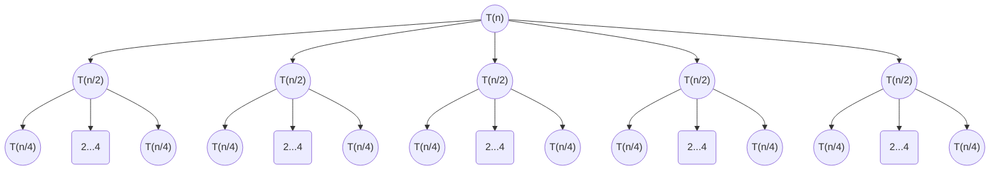

<extra-script>
<link rel="stylesheet" href="https://cdn.jsdelivr.net/npm/pseudocode@latest/build/pseudocode.min.css">

</extra-script>

# Divide and Conquer

## Master Theorem

- Observe that

    - \\(T(n) = 2T(n/2) + O(n) : T(n) \in O(n \log n)\\) (Mergesort)
    -  \\(T(n) = 4T(n/2) + O(n) : T(n) \in O(n^2)\\) (Regular integer multiplication)
    - \\(T(n) = 3T(n/2) + O(n) : T(n) \in O(n^{\log_2(3)})\\) (Karatsuba Multiplication)

- The Master Theorem for some recurrence \\(T(n) = aT(n/b) + f(n)\\):

    - Define \\(c = \log_b(a)\\)

    - If \\(f(n) \in O(n^{c-\varepsilon})\\) for some \\(\varepsilon > 0\\) then \\(T(n) \in \Theta(n^c)\\) (The work increases as we go down the levels, bottom level dominates the cost)

    - If \\(f(n) \in \Theta(n^{c})\\) then \\(T(n) \in \Theta(n^c \log n)\\) (The work remain the same as we go down the level, all level contribute equally to the cost)

    - If \\(f(n) \in \Omega(n^{c + \varepsilon})\\) for some \\(\varepsilon > 0\\) then \\(T(n) \in \Theta(f(n))\\) (The work decreases as we go down the levels, top level does most of the work)

    - There is an additional condition that COMP3711 ignores?? Why?

- Visualization for Master Theorem

- Case 1

- \\(T(n) = 5T(n/2) + n^2 \to c = \log_2(5) > 2 \to f(n) = n^2 \in O(n^{\log_2(5) - \varepsilon}) \to T(n) \in \Theta(n^{\log_2(5)})\\)

| Level | Number of Process | Work / Process | Work / Level |
|---|---|---|---|
|0|\\(1\\)|\\(n^2\\)|\\(n^2\\)|
|1|\\(5\\)|\\((n/2)^2\\)|\\((5/4)n^2\\)|
|2|\\(5^2\\)|\\((n/4)^2\\)|\\((5^2/4^2)n^2\\)|
|...|...|...|...|
|\\(L=\log_2(n)\\)|\\(5^L\\)|\\((n/2^L)^2\\)|\\((5/4)^Ln^2\\)|

- Note that \\(L\\) is the amount of level
    
- Here, we see that the total work in all level is:

    - \\( \underbrace{\sum_{i=0}^L 5^i}\_{\textsf{Process Splitting Part}} +  \underbrace{n^2\sum\_{i=0}^L \left(\frac{5}{4}\right)^i}_{\textsf{Total Work Part}} = \Theta(5^L) + n^2\Theta(\left(\frac{5}{4}\right)^L) \\)

    - Here, the term \\(5^{\log_2(n)}=n^{\log_2(5)} > n^2 \cdot \left(\frac{5}{4}\right)^{\log_2(n)} = n^2 \cdot n^{\log_2\left(\frac54\right)}\\) dominates

    - Hence, \\(T(n) \in \Theta(n^{\log_2(5)})\\)

- Case 2

- \\(T(n) = 2T(n/2) + n \to c = 1 \to f(n) = n \in \Theta(n^c) \to T(n) \in \Theta(n \log n) \\)

| Level | Number of Process | Work / Process | Work / Level |
|---|---|---|---|
|0|\\(1\\)|\\(n\\)|\\(n\\)|
|1|\\(2\\)|\\((n/2)\\)|\\(n\\)|
|2|\\(2^2\\)|\\((n/4)\\)|\\(n\\)|
|...|...|...|...|
|\\(L=\log_2(n)\\)|\\(2^L\\)|\\((n/2^L)\\)|\\(n\\)|

- Again, \\(L\\) is also the amount of level

- Here, we see that the total work in all level is:

    - \\(\underbrace{\sum_{i=0}^L 2^i}\_{\textsf{Process Splitting Part}} + \underbrace{n \sum_{i=0}^L 1}\_{\textsf{Total Work Part}} = \Theta(n) + \Theta(n \log_2 (n))\\)

    - Here, the term \\(n \log_2 (n)\\) dominates, hence \\(T(n) \in \Theta(n \log n)\\)

- Case 3

- \\(T(n) = 3T(n/7) + n \to c = \log_2(1) = 0 \to f(n) = n \in \Omega(n^{c + \varepsilon}) \to T(n) \in \Theta(f(n)) = \Theta(n)\\)

| Level | Number of Process | Work / Process | Work / Level |
|---|---|---|---|
|0|\\(1\\)|\\(n\\)|\\(n\\)|
|1|\\(3\\)|\\((n/7)\\)|\\((3/7)n\\)|
|2|\\(3^2\\)|\\((n/7^2)\\)|\\((3/7)^2n\\)|
|...|...|...|...|
|\\(L=\log_7(n)\\)|\\(3^L\\)|\\((n/7^L)\\)|\\((3/7)^L n\\)|

- Here, we see that the total work in all level is:

    - \\(\underbrace{\sum_{i=0}^L 3^L}\_{\textsf{Process Splitting Part}} + \underbrace{n \sum_{i=0}^L (3/7)^i}\_{\textsf{Total Work Part}} = \Theta(3^L) + \Theta(n (3/7)^L) = \Theta(n ^{\log_7(3)}) + n \cdot \Theta(1) \\)

    - Hence, the \\(\Theta(n)\\) term dominates and \\(T(n) \in \Theta(n)\\)

- Other Master Theorem

    - \\(T(n) = \sum_{i=1}^k T(\alpha_i n) + n\\) given \\(\forall i, \alpha_i > 0\\) and \\(\sum_{i=1}^k\alpha_i < 1\\)

    - Example: \\(T(n) = T(3n/4) + T(n/7) + n \to T(n) \in \Theta(n)\\)

<extra-script>

</extra-script>